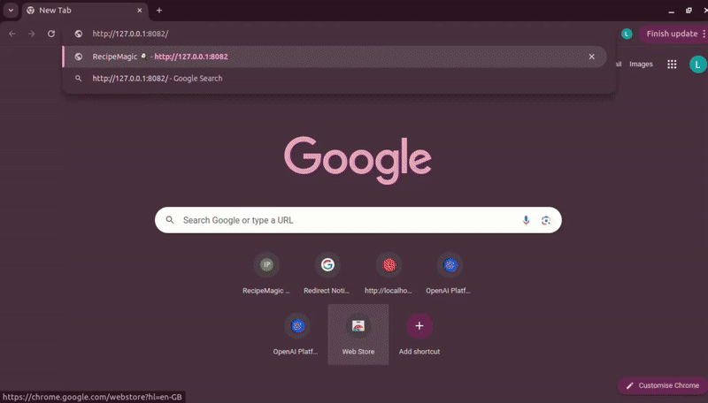

RecipeMagic: The Custom Recipe Generator

RecipeMagic is a smart recipe generator that creates custom recipes based on the ingredients you have on hand, your dietary preferences, and your cooking style. Say goodbye to food waste and hello to delicious, spontaneous meals!

✨ Features
Ingredient-Based Suggestions: Enter the ingredients you have, and get a recipe that uses them.

Customizable Servings: Adjust the recipe for the number of people you're cooking for.

Dietary Filters: Find recipes that match your needs (e.g., vegan, gluten-free, low-carb). (Coming Soon!)

Save Your Favorites: Keep a personal collection of the recipes you love.

Simple & Clean UI: An easy-to-use interface that makes finding and following recipes a breeze.

🚀 Getting Started
Follow these instructions to get a local copy of RecipeMagic up and running for development and testing purposes.

Prerequisites
You will need to have the following installed on your system:

Python 3.8+

pip (Python package installer)

A virtual environment tool (like venv or virtualenv)

Installation
Clone the repository:

git clone https://github.com/peethalasharmilaakanksha/RecipeMagic.git
cd RecipeMagic

Create and activate a virtual environment:

On macOS and Linux:

python3 -m venv venv
source venv/bin/activate

On Windows:

python -m venv venv
.\venv\Scripts\activate

Install the required packages:

pip install -r requirements.txt

Set up environment variables:
Create a .env file in the root directory and add your configuration details, such as your Firebase credentials and any API keys.

# .env file

FLASK_APP=app.py
FLASK_ENV=development

# Add your Firebase and other API keys here

Run the application:

flask run

Open your browser and navigate to http://127.0.0.1:5000 to see the app in action!

🤝 Contributing
Contributions are what make the open-source community such an amazing place to learn, inspire, and create. Any contributions you make are greatly appreciated.

If you have a suggestion that would make this better, please fork the repo and create a pull request. You can also simply open an issue with the tag "enhancement".

Fork the Project

Create your Feature Branch (git checkout -b feature/AmazingFeature)

Commit your Changes (git commit -m 'Add some AmazingFeature')

Push to the Branch (git push origin feature/AmazingFeature)

Open a Pull Request

📄 License
Distributed under the MIT License. See LICENSE.txt for more information.

📧 Contact
Your Name - peethalasharmilaakanksha@gmail.com

Project Link: https://github.com/peethalasharmilaakanksha/RecipeMagic
